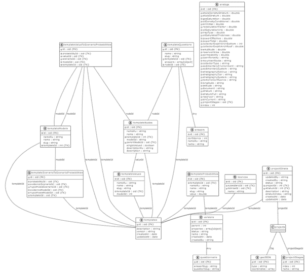

# Integrated cognitive system design

An integrated cognitive business system for objectively accounting for uncertainties in probabilistic resource base assessment.

# Table of contents
- [Integrated cognitive system design](#integrated-cognitive-system-design)
- [Table of contents](#table-of-contents)
- [Purpose of the document](#purpose-of-the-document)
- [Aims and objectives of the project](#aims-and-objectives-of-the-project)
- [Project prerequisites](#project-prerequisites)
- [Functional roles](#functional-roles)
- [Functional requirements](#functional-requirements)
- [Non-functional requirements](#non-functional-requirements)
- [List of related systems and external interfaces](#list-of-related-systems-and-external-interfaces)
- [Strategy for selecting a target solution](#strategy-for-selecting-a-target-solution)
- [Context and scope](#context-and-scope)
  - [Integration of technical systems](#integration-of-technical-systems)
- [Integration Architecture](#integration-architecture)
  - [Business systems integration diagram](#business-systems-integration-diagram)
  - [Register of integration interfaces](#register-of-integration-interfaces)
- [Information architecture of the solution](#information-architecture-of-the-solution)
  - [Logical data model](#logical-data-model)
  - [Physical data model](#physical-data-model)
- [List of directories](#list-of-directories)
  - [Data protection](#data-protection)
- [Deployment view](#deployment-view)
  - [Software and hardware components of the infrastructure](#software-and-hardware-components-of-the-infrastructure)
- [Architecture decision records](#architecture-decision-records)
  - [ADR-1: Software licensing](#adr-1-software-licensing)
    - [Licensing of application software](#licensing-of-application-software)
    - [System-wide software licensing](#system-wide-software-licensing)
    - [Licensing of information security software](#licensing-of-information-security-software)
  - [ADR-2: Scaling the system](#adr-2-scaling-the-system)
  - [ADR-3: Data security](#adr-3-data-security)

# Purpose of the document

This document identifies the main technical solutions that must be implemented to fulfill the requirements formed in the Terms of Reference for the digital project at the MVP Creation stage.

# Aims and objectives of the project

The goal of the project is to improve the quality of decision making and automation of routine exploration operations.

# Project prerequisites

The System under development is aimed at identification, modeling, integration and prediction of parameters for the evaluated geological object using artificial intelligence technology.

The premise of the project is the need to accelerate the analysis of geological and geophysical information and to improve the quality of preparation of the geological basis for decision making, starting from the earliest stage of exploration through:

* early data integration and identification of data inconsistencies and management of uncertainties
* balancing the need for information with the cost of obtaining it
* reducing errors and reassessments and automating routine operations

# Functional roles

<table>
  <tr>
   <td><strong>Role</strong>
   </td>
   <td><strong>Core functionality of the role</strong>
   </td>
  </tr>
  <tr>
   <td>Project team member
   </td>
   <td>
<ul>

<li>Starts/edits/deletes projects at different levels

<li>Fills in the properties of the geologic object

<li>Sets/edits the composition of the project team (in perspective)

<li>Assigns tasks to project team members (in perspective)

<li>Defines the master version of the geologic scenario calculation

<li>Fills in the properties of the geologic object

<li>Contacts the Expert on the validation of the geological scenario calculation
</li>
</ul>
   </td>
  </tr>
  <tr>
   <td>Data-scientist
   </td>
   <td>
<ul>

<li>Changes methodology in accordance with comments and observations and the resulting calculations.

<li>Adds, edits and deletes analog data
</li>
</ul>
   </td>
  </tr>
  <tr>
   <td>Expert
   </td>
   <td>
<ul>

<li>Reviews projects at any level

<li>Reviews properties of geological objects and justification of feature values

<li>Confirms the results of calculations, selects and fixes the master version of the calculation

<li>Sends the calculation for revision

<li>Sends comments to the obtained results from the point of view of methodology
</li>
</ul>
   </td>
  </tr>
  <tr>
   <td>Knowledge Engineer
   </td>
   <td>
<ul>

<li>Manages knowledge templates: creation, deletion, description change, attribute composition change, versioning control

<li>Adding/editing knowledge base records

<li>Adding/editing records of internal system directories
</li>
</ul>
   </td>
  </tr>
  <tr>
   <td>System Administrator
   </td>
   <td>System Configuration Management

Managing user role access at the project level:
<ul>

<li>Viewing the list of projects

<li>View project type by access level, without access to other project information in the System

<li>Viewing project teams of projects (prospectively)

<li>Changing the Project Owner in case of a request from a manager from a business unit (in the future)
</li>
</ul>
</td>
</tr>

<tr>
<td>Information Security Auditor</td>
<td>Within the System, this system role must have access to control system user assignment of access to objects within the System to the following extent:
    <ul>
        <li>Viewing the project list.</li>
        <li>Viewing project type by access level, without access to other project information within the System.</li>
        <li>Viewing project teams of projects (in the future).</li>
</ul>
The core functionality of the IS Auditor shall be accessible outside of the System via a user in related PaaS Platform systems:
<ul>

<li>Monitoring user actions;</li>

<li>Checking the functionality of the mechanism for logging user actions.
</li>

</ul>
</li>
</ul>
   </td>
  </tr>
</table>

# Functional requirements

Functional requirements for the system are divided into several blocks of functionality:
* FR-1: General requirements for system operation
* FR-2: Requirements to work with system projects
* FR-3: Requirements to work with geological maps
* FR-4: Requirements to work with geological objects
* FR-5: Requirements for the analogy search module
* FR-6: Requirements for the module of calculation of probabilities of geologic scenarios of geological model
* FR-7: Requirements for the module of pre-study recommendations
* FR-8: Requirements for the knowledge base
* FR-9: Requirements for the data partitioning module
* FR-10: Requirements for reporting and product analytics
* FR-11: Requirements for interaction with related systems
* FR-12: Requirements for auditing user actions
* FR-13: Role model requirements and access management
* FR-14: Requirements for the module of pre-study recommendations
* FR-15: Requirements for the functions of geological model construction

# Non-functional requirements

**NFR-1: Basic requirements to the system data quality**
For correct operation of the system a data verification tool based on the tool tested in the prototype should be implemented, so that in automatic mode the data coming into the system were of correct dimensionality, complete, consistent, corresponded to the units of measurement for each parameter, data outliers were taken into account.

**NFR-2: Main requirements to the system data quality**

The task of data quality assurance lies on the data sources (Geodatabase, Seismological archive, Regulatory reference information database, Kern, etc.).

Performance requirements:
* Support of at least 100 concurrent users
* Scalability up to 500 or more users
* Scalability for simultaneous support of an unlimited number of wells and relevant calculations
* System response time is no more than 15 seconds
* Loading of forms with calculations at opening - no more than 30 seconds
* Formation of reports by specified parameters on the volume of data of one organizational unit - no more than 3 minutes for simple reports. For reports that require complex calculations the time of formation can be longer by agreement with the Customer.

**NFR-3: Containerization**

General containerization requirements:
1. A project solution that has containers as part of it must be compatible with the OKD platform and Red Hat OpenShift version 4.6+, version 3.11.
2. Version 3.11 will be decommissioned throughout 2021 and remains available, but it is recommended to adapt the project to version 4.6 (UBI 8 base layer) in advance.
3. Running containers in privileged mode is not possible.
4. Rushing privileged ports (up to 1024) to a container is not possible.
5. Mounting the root file system of the container is possible in read-only mode.
6. There must be no files with setuid, setgid permissions in the container image.
7. SELinux is active on the containerization platform. SCC policies are applied.
8. The project solution must satisfy the rule: 1 process - 1 application in 1 container.
9. The containers of the design solution must provide correct SIGTERM processing for application restarts.
10. It must be possible to horizontally scale the containers with microservices by scaling factor.
11. Each container must be configured with mandatory resource limits for each container
12. Container images must be delivered with configured Liveness- and Readiness- samples.
13. Microservices in the container must support passing events to STDOUT to collect logs.
14. The project solution must support publishing application metrics via HTTP endpoint /metrics (Prometheus).
15. The project solution must support the ability to define configuration via ENV variables or via a configuration file.
16. Base container images must be based on catalog.redhat.com, quay.io, mcr.microsoft.com.
17. Container images may not be imported directly into the artifact repository without using a pipeline.

**NFR-4: Orchestration**

Orchestrator Requirements:
1. The design solution must be compatible with the customer's orchestrator - Jenkins, any other orchestrators are not supported.
2. Jenkins file must meet the customer's format requirements
3. Software should be built in a container.

**NFR-5: Source code repository**

Source code repository requirements:
4. The implementer-side source code repository must support the GIT format. Repository formats other than GIT are not supported by the customer (CVS, SVN, Mercurial, etc.).
5. The structure of the executor-side source code repository must match the structure of the PaaS repository.
6. The code repository must be accessible from the Internet, via http/https protocols, by login and password provided to the customer. The customer does not support key access to external repositories (SSH, HTTPS).
7. One source code repository shall contain no more than one microservice.

**NFR-6: Artifact/dependency repository**

Artifact repository requirements\ dependencies:
1. The design solution must be compatible with the customer artifact repository - Sonatype Nexus.
2. Artifact/dependency repositories must be accessible from the Internet, via http/https protocols, by login and password provided to the customer.
3. Artifacts/libraries must be built from source code on the PaaS pipeline if the license allows such a build.
4. Artifacts/libraries can be proxied from an external artifact repository in compiled form, in case the license\right to use does not allow building in the project. In this case, documentation must be provided to the project IS specialist.

**NFR-7: Design layouts**
* The results are transmitted in the format of the used development tool in an editable format.
* Develop interface design on the corporate design system

**NFR-8: Identification and authentication**
1. Identification and authentication of users in the System shall be carried out by personalized accounts in the corporate domain MS Active Directory, or through another corporate authentication provider, using modern secure authentication protocols. The use of NTLM authentication protocol is not allowed if the Kerberos authentication protocol is technically possible. Single Sign-On technology must be used in the perimeter of the network.
2. The System shall have technical (service) accounts intended for identification and authentication of access subjects and their authorization when creating integration links with related systems and when interacting between system components, if necessary. It is not allowed to use impersonal (anonymized) user accounts of the system. Objects and subjects of access within the System shall be documented.
3. The System shall provide identification and authentication of users when logging into the System using a password that meets the requirements of the methodological document "Requirements for the use of passwords".

**NFR-9: Access control**
1. Depending on the role, and belonging to a division, users are granted different access rights to data and system functions.
2. Authorization and management of user access to the user's system shall be in accordance with Company standards.
3. Identification and authentication of access subjects at login to the system by an identifier (code) and a conditionally-permanent password shall be performed. 
4. Identification of terminals, computers, computer network nodes, communication channels, external computer devices by logical names shall be performed.
5. Identification of programs, volumes, directories, files, records, record fields by names shall be performed.
6. Subjects' access to protected resources shall be controlled in accordance with the access matrix.

**NFR-10: Network security**

Network security shall be implemented in accordance with the requirements of the Company's Information Security Policy:
1. Division of information system networks into segments in accordance with the security policy.
2. Restricting access of users/devices to information resources in different network segments.
3. Blocking inter-network communication traffic that does not comply with the security policy.
4. Filtering of data packets based on specified compliance criteria

**NFR-11: Security monitoring**
1. A security control subsystem must be implemented that realizes the functions of:
    * Monitoring to detect vulnerabilities in hardware and software based on comprehensive or random tests of network services, operating systems, application software, routers, and firewalls.
    * Providing recommendations for remediation of identified vulnerabilities.
    * Creating reports with different levels of detail.
2. Integration with the MaxPatrol corporate security monitoring system must be provided.

**NFR-11: Cryptographic protection**
3. Data protection must be ensured during transmission via communication channels.
4. Access of users and service providers, as well as integration interactions shall be carried out using secure information interaction protocols that do not have current vulnerabilities.
5. When organizing access via HTTPS, the TLS protocol of version 1.2 or higher shall be used.
6. If there is a need to transmit confidential information via open communication channels, the means of cryptographic protection of information with a valid certificate of compliance with the requirements of the Federal Security Service of Russia shall be used.
7. The system shall store secrets (passwords, database connection strings, etc.) in a special protected secrets storage in case of organizational and technical capability of the PaaS platform.
8. Storing secrets in code or configuration files is prohibited.

# List of related systems and external interfaces

Basic requirements for external interfaces for the MVP Development phase.

<table>
  <tr>
   <td><strong>№</strong>
   </td>
   <td><strong>Related business system</strong>
   </td>
   <td><strong>Interaction description</strong>
   </td>
  </tr>
  <tr>
   <td>1.      
   </td>
   <td>MS Active Directory
   </td>
   <td>Identification and authentication of users in the System shall be carried out by personalized accounts in the corporate domain MS Active Directory, or through another corporate authentication provider, using modern secure authentication protocols. The use of NTLM authentication protocol in the presence of technical possibility of using Kerberos authentication protocol is not allowed. Single Sign-On technology should be used in the network perimeter.

The target variant of the solution should be realized through a single SSO service based on KeyCloak with the help of API-requests of service services of the corporate PaaS platform.
   </td>
  </tr>
  <tr>
   <td>2.      
   </td>
   <td>SSO
   </td>
   <td>Integration of KeyCloak-based SSO as a service of enterprise PaaS platform via API and tokens from web-browser for user authentication in MS Active Directory.
   </td>
  </tr>
  <tr>
   <td>3.      
   </td>
   <td>ArcSight
   </td>
   <td>The system should provide cascading (not direct) integration with ArcSight system to upload logs through API interfaces of service services of the corporate platform PaaS. Integration with ArcSight shall be realized through the Fluentd system.
   </td>
  </tr>
  <tr>
   <td>4.      
   </td>
   <td>Fluentd
   </td>
   <td>Integration with EFK-based Fluentd as a service of the enterprise PaaS platform by uploading CEF messages to StdOut to transfer logs and events in the system for onward transmission to ArcSight
   </td>
  </tr>
  <tr>
   <td>5.      
   </td>
   <td>Vault
   </td>
   <td>The system should provide cascading (not direct) integration with Vault as a service of the corporate PaaS platform for storing secrets (passwords and access keys). Integration can be realized through Jenkins.
   </td>
  </tr>
  <tr>
   <td>6.      
   </td>
   <td>Cloudian HyperStore
   </td>
   <td>Integration with Cloudian HyperStore via API over HTTPS to store system related documents
   </td>
  </tr>
  <tr>
   <td>7.      
   </td>
   <td>GIS
   </td>
   <td>Integration with Antreal GIS via WFS and WMS format APIs via HTTPS protocol to obtain map substrate and geo-object information.
   </td>
  </tr>
  <tr>
   <td>8.      
   </td>
   <td>MS Exchange
   </td>
   <td>Integration with MS Exchange via SMTP with encryption for sending feedback form messages to the technical support service
   </td>
  </tr>
</table>

# Strategy for selecting a target solution

The business system is being developed as a custom development of a digital product using an agile methodology.

Before the start of the project an expert assessment together with the business of potentially possible implementation options was carried out and the following analysis results were obtained:
* On the market of specialized software in geology and system development there are no solutions that fully possess the required functionality, as well as meet the required flexibility in terms of calculations, the ability to configure the required algorithms, integration capabilities, usability. 
* In this regard, the selection of alternative solutions was not carried out - it was decided to implement the solution as a custom development.

# Context and scope

Below is a context diagram that shows a list of actors and external systems related to the solution.

To implement the required functionality on the scope of open source software it is necessary to create 4 landscapes to ensure the process of development and updating of the code and components of the solution in the course of iterative development using DevSecOps corporate pipeline architecture and solutions of the PaaS Platform, including the containerized corporate CaaS platform.

The main components of the IT solution foundation for the current stage of System development are:
* MongoDB DBMS;
* NGINX Web-server for web-proxy and web-service static Front-End;
* Executable modules in Node.JS language and Nest, Express, React, Redux frameworks;
* Executable modules in Python language based on FastAPI;
* Microservice environment based on OKD and OpenShift container platform.

The target system landscape is planned with the following composition:
* Development Landscape in the Data Center on the DEV resources of the SaaS platform;
* Test landscape in the  Data Center on the UAT resources of the SaaS platform;
* Pre-productive landscape in the  Data Center on the STAGE resources of the SaaS platform;
* Productive landscape in the Data Center on the STAGE resources of the SaaS platform;

The container diagram of the business system for the current version of the solution is shown in the following figure.

## Integration of technical systems

For the implementation of CI/CD development processes, integration technical interaction between different segments of the business system with corporate utility services implemented in the related DevSecOps project is used. 

Git replication is used to transfer all code sources and configuration files in YAML format to run containers. 

# Integration Architecture

## Business systems integration diagram

The current integration diagram of the IT solution's related business systems is shown in the figure below.

The following integrations are implemented at the MVP Development stage:
* With MS Active Directory for authentication and access authorization integration not directly, but through the system SSO based on KeyCloak as part of the PaaS platform;
* Integration with ArcSight for uploading security events not directly, but through the system Fluend as part of the PaaS platform;
* With Antreal GIS system for utilization of map information;
* With Cloudian HyperStore system for object S3 storage;
* With MS Exchange system for transfer of mail messages with feedback form;
* With the system 1C for receiving actual corporate directories.

When realizing the target diagram of integration of related business systems of the IT solution can be clarified at subsequent stages of the project. The target diagram of business systems integration is designed iteratively in the process of development realization.

## Register of integration interfaces

The register describes the list of integration interfaces that realize information exchange between business systems. This table will be updated at subsequent stages of the digital project.

<table>
  <tr>
   <td rowspan="2" ><strong>№</strong>
   </td>
   <td rowspan="2" ><strong>Business process</strong>
   </td>
   <td rowspan="2" ><strong>Step</strong>
   </td>
   <td rowspan="2" ><strong>Sender</strong>
   </td>
   <td rowspan="2" ><strong>Senders interface</strong>
   </td>
   <td rowspan="2" ><strong>Senders message</strong>
   </td>
   <td rowspan="2" ><strong>SendersFormat</strong>
   </td>
   <td rowspan="2" ><strong>Receiver</strong>
   </td>
   <td rowspan="2" ><strong>Description</strong>
   </td>
  </tr>
  <tr>
  </tr>
  <tr>
   <td>1. 	 
   </td>
   <td>Authentication and Authorization
   </td>
   <td>Authentication (Single-Sign-On)
   </td>
   <td>Smart geologist
   </td>
   <td>API KeyCloak
   </td>
   <td>JWT user token
   </td>
   <td>OpenID Connect
   </td>
   <td>SSO
   </td>
   <td>Validation of JWT token from HTTP header received from user's browser
   </td>
  </tr>
  <tr>
   <td>2. 	 
   </td>
   <td>Authentication and Authorization
   </td>
   <td>Retrieving user information
   </td>
   <td>SSO
   </td>
   <td>API KeyCloak
   </td>
   <td>AD user login and its attributes
   </td>
   <td>OpenID Connect
   </td>
   <td>Smart geologist
   </td>
   <td>Retrieving user information
   </td>
  </tr>
  <tr>
   <td>3. 	 
   </td>
   <td>Logging
   </td>
   <td>Access to security event logs
   </td>
   <td>Cognitive geologist
   </td>
   <td>Container STDout (standard system output)
   </td>
   <td>Event log entries
   </td>
   <td>CEF
   </td>
   <td>Fluentd
   </td>
   <td>Uploads of system logs (logs) and information security events
   </td>
  </tr>
  <tr>
   <td>4. 	 
   </td>
   <td>Uploading files
   </td>
   <td>Uploading files for geo model
   </td>
   <td>Cloudian HyperStore
   </td>
   <td>HTTPS, S3 API
   </td>
   <td>New files for download related to geo model
   </td>
   <td>File blocks
   </td>
   <td>Smart geologist
   </td>
   <td>Uploading files for geo model
   </td>
  </tr>
  <tr>
   <td>5. 	 
   </td>
   <td>File retrieval
   </td>
   <td>Uploading files for geo model
   </td>
   <td>Cloudian HyperStore
   </td>
   <td>HTTPS, S3 API
   </td>
   <td>Previously downloaded files related to geo model
   </td>
   <td>File blocks
   </td>
   <td>Smart geologist
   </td>
   <td>Uploading files for geo model
   </td>
  </tr>
  <tr>
   <td>6. 	 
   </td>
   <td>Obtaining a map substrate
   </td>
   <td>Map view
   </td>
   <td>GIS
   </td>
   <td>HTTPS, API WMS
   </td>
   <td>Map substrate (tiles)
   </td>
   <td>Graphical tiles (map peaces)
   </td>
   <td>Smart geologist
   </td>
   <td>Obtaining a map substrate for map viewing
   </td>
  </tr>
  <tr>
   <td>7. 	 
   </td>
   <td>Obtaining geo-object data
   </td>
   <td>Viewing geo-object data
   </td>
   <td>GIS
   </td>
   <td>HTTPS, API WFS
   </td>
   <td>Geo-object attributes
   </td>
   <td>GeoJSON
   </td>
   <td>Smart geologist
   </td>
   <td>Getting attributes of GEO-objects on the map
   </td>
  </tr>
  <tr>
   <td>8. 	 
   </td>
   <td>Working with geo-objects in the system
   </td>
   <td>Working with geo-objects in the system
   </td>
   <td>Smart geologist
   </td>
   <td>SMTP (tcp 578)
   </td>
   <td>Mail message for technical support
   </td>
   <td>Текст
   </td>
   <td>MS Exchage
   </td>
   <td>Sending feedback form mail messages
   </td>
  </tr>
  <tr>
   <td>9. 	 
   </td>
   <td>Working with directories
   </td>
   <td>Updating of directories
   </td>
   <td>1С
   </td>
   <td>SOAP

Message
   </td>
   <td>directory entries
   </td>
   <td>XML
   </td>
   <td>Smart geologist
   </td>
   <td>Sending corporate directory records from 1C source system in XML format when changing a record or in manual mode in Smart Geologist REST API receiver format to JSON format
   </td>
  </tr>
</table>

# Information architecture of the solution

## Logical data model

The diagram of the current logical model of the data processed by the business system is shown in the following figure.

When implementing the target data model, refinements are possible during the iterative development of the IT solution.

## Physical data model

Instead of separate attribute diagrams describing the composition of attributes of a business system entity type for each type of system entity separately, a physical data model diagram is provided, which allows not only describing the composition of attributes, but also tracing the relationship between these attributes and different business entities (subject area entities) of the business system.

# List of directories

This section captures potential reference guides for the target solution. Since the business system belongs to block systems, it is necessary to use reference master directories from the 1C system.

1. License areas
2. Deposits
3. Field statuses
4. Correspondence of Fields and License Areas
5. Licenses
6. License Status
7. Subsoil Users
8. Types of subsoil users
9. Strata
10. Territorial Units
11. Types of Territorial Units
12. Types of stratigraphic elements
13. Types of stratigraphic zoning elements
14. Geological types of deposits
15. Objects of development
16. Objects of accounting
17. Types of traps
18. Characteristics of lithologic composition
19. Characteristics of formations
20. Deposits
21. Stratigraphy

## Data protection

According to the criticality class, the information system is classified as "Supporting".

* RTO 48 h. - in what time the system will work after a failure;
* RPO 24 h - what interval of data loss is acceptable.

For the target variant of the architecture, catastrophic resilience solutions are not applied. Only partially solutions for high availability within one data center.

The following storages are used for permanent storage of application data in the system:
* NoSQL MongoDB database management system for storing system data objects and their attributes inside containers with Persistent Volume allocation in each CaaS/PaaS system landscape;
* Object storage of S3 files in separate buckets allocated to each system landscape in a contiguous Cloudian HyperStore system.

Control of temporary data integrity in the System is carried out by means of DBMS. Storage of input data in a normalizable form is provided. For the current architecture DBMS replication solutions to ensure data integrity are not applied. 

# Deployment view

A diagram of the solution landscape deployment is shown in the figure below.

The System includes four landscapes: 
* Productive (PROD) - a fully functional landscape ensuring fulfillment of the NFR, including performance and fault tolerance requirements;
* Pre-productive (STAGE/PREDPROD) - a landscape fully approximating the productive landscape in terms of the composition of system components and technical characteristics in accordance with the NFR. It is intended, among other things, for integration testing;
* Test (UAT) - a landscape close to the development landscape in terms of system components, but with increased productivity for functional testing tasks;
* Development (DEV) - a landscape with remote access for developers and key users, but with minimal technical indicators for performance and NFR provision.

Requirements for the system and components in the Productive Productive Landscape (PROD):

<table>
  <tr>
   <td><strong>Name</strong>
   </td>
   <td><strong>Type</strong>
   </td>
   <td><strong>CPU</strong>
   </td>
   <td><strong>Mem, GB</strong>
   </td>
   <td><strong>SSD, GB</strong>
   </td>
   <td><strong>HDD</strong>
   </td>
   <td><strong>Software Requirements</strong>
   </td>
  </tr>
  <tr>
   <td>POD-Backend-API
   </td>
   <td>Container in a productive namespace

(Application Server)
   </td>
   <td>2
   </td>
   <td>4
   </td>
   <td>40
   </td>
   <td> 
   </td>
   <td>UBI

Node.JS (NestJS)
   </td>
  </tr>
  <tr>
   <td>POD-NoSQL-DBMS
   </td>
   <td>Container in a productive namespace

(Database Server)
   </td>
   <td>2
   </td>
   <td>8
   </td>
   <td>100
   </td>
   <td> 
   </td>
   <td>UBI

Mongodb
   </td>
  </tr>
  <tr>
   <td>POD-DS-Reasoner
   </td>
   <td>Container in a productive namespace

(DS Application Server)
   </td>
   <td>4
   </td>
   <td>8
   </td>
   <td>40
   </td>
   <td> 
   </td>
   <td>UBI

Python 3.x (FastAPI)
   </td>
  </tr>
  <tr>
   <td>POD-Front-web
   </td>
   <td>Container in a productive namespace

(Web Server)
   </td>
   <td>1
   </td>
   <td>2
   </td>
   <td>4
   </td>
   <td> 
   </td>
   <td>UBI

Nginx
   </td>
  </tr>
  <tr>
   <td> 
   </td>
   <td>Total:
   </td>
   <td>9
   </td>
   <td>22
   </td>
   <td>184
   </td>
   <td> 
   </td>
   <td> 
   </td>
  </tr>
</table>

System and component requirements in the pre-production landscape (STAGE):

<table>
  <tr>
   <td><strong>Name</strong>
   </td>
   <td><strong>Type</strong>
   </td>
   <td><strong>CPU</strong>
   </td>
   <td><strong>Mem, GB</strong>
   </td>
   <td><strong>SSD, GB</strong>
   </td>
   <td><strong>HDD</strong>
   </td>
   <td><strong>Software Requirements</strong>
   </td>
  </tr>
  <tr>
   <td>POD-Backend-API
   </td>
   <td>Container in a pre-production namespace

(Application Server)
   </td>
   <td>2
   </td>
   <td>4
   </td>
   <td>40
   </td>
   <td> 
   </td>
   <td>UBI

Node.JS (NestJS)
   </td>
  </tr>
  <tr>
   <td>POD-NoSQL-DBMS
   </td>
   <td>Container in a pre-production namespace

(Database Server)
   </td>
   <td>2
   </td>
   <td>8
   </td>
   <td>100
   </td>
   <td> 
   </td>
   <td>UBI

Mongodb
   </td>
  </tr>
  <tr>
   <td>POD-DS-Reasoner
   </td>
   <td>Container in a pre-production namespace

(DS Application Server)
   </td>
   <td>4
   </td>
   <td>8
   </td>
   <td>40
   </td>
   <td> 
   </td>
   <td>UBI

Python 3.x (FastAPI)
   </td>
  </tr>
  <tr>
   <td>POD-Front-web
   </td>
   <td>Container in a pre-production namespace

(Web Server)
   </td>
   <td>1
   </td>
   <td>2
   </td>
   <td>4
   </td>
   <td> 
   </td>
   <td>UBI

Nginx
   </td>
  </tr>
  <tr>
   <td> 
   </td>
   <td>Total:
   </td>
   <td>9
   </td>
   <td>22
   </td>
   <td>184
   </td>
   <td> 
   </td>
   <td> 
   </td>
  </tr>
</table>

System and component requirements in the testing landscape (UAT):

<table>
  <tr>
   <td><strong>Name</strong>
   </td>
   <td><strong>Type</strong>
   </td>
   <td><strong>CPU</strong>
   </td>
   <td><strong>Mem, GB</strong>
   </td>
   <td><strong>SSD, GB</strong>
   </td>
   <td><strong>HDD</strong>
   </td>
   <td><strong>Software Requirements</strong>
   </td>
  </tr>
  <tr>
   <td>POD-Backend-API
   </td>
   <td>Container in a testing namespace

(Application Server)
   </td>
   <td>2
   </td>
   <td>4
   </td>
   <td>40
   </td>
   <td> 
   </td>
   <td>UBI

Node.JS (NestJS)
   </td>
  </tr>
  <tr>
   <td>POD-NoSQL-DBMS
   </td>
   <td>Container in a testing namespace

(Database Server)
   </td>
   <td>2
   </td>
   <td>8
   </td>
   <td>100
   </td>
   <td> 
   </td>
   <td>UBI

Mongodb
   </td>
  </tr>
  <tr>
   <td>POD-DS-Reasoner
   </td>
   <td>Container in a testing namespace

(DS Application Server)
   </td>
   <td>4
   </td>
   <td>8
   </td>
   <td>40
   </td>
   <td> 
   </td>
   <td>UBI

Python 3.x (FastAPI)
   </td>
  </tr>
  <tr>
   <td>POD-Front-web
   </td>
   <td>Container in a testing namespace

(Web Server)
   </td>
   <td>1
   </td>
   <td>2
   </td>
   <td>4
   </td>
   <td> 
   </td>
   <td>UBI

Nginx
   </td>
  </tr>
  <tr>
   <td> 
   </td>
   <td>Total:
   </td>
   <td>9
   </td>
   <td>22
   </td>
   <td>184
   </td>
   <td> 
   </td>
   <td> 
   </td>
  </tr>
</table>

System and component requirements in the development landscape (DEV):

<table>
  <tr>
   <td><strong>Name</strong>
   </td>
   <td><strong>Type</strong>
   </td>
   <td><strong>CPU</strong>
   </td>
   <td><strong>Mem, GB</strong>
   </td>
   <td><strong>SSD, GB</strong>
   </td>
   <td><strong>HDD</strong>
   </td>
   <td><strong>Software Requirements</strong>
   </td>
  </tr>
  <tr>
   <td>POD-Backend-API
   </td>
   <td>Container in dev namespace

(Application Server)
   </td>
   <td>2
   </td>
   <td>4
   </td>
   <td>40
   </td>
   <td> 
   </td>
   <td>UBI

Node.JS (NestJS)
   </td>
  </tr>
  <tr>
   <td>POD-NoSQL-DBMS
   </td>
   <td>Container in dev namespace

(Database Server)
   </td>
   <td>2
   </td>
   <td>4
   </td>
   <td>50
   </td>
   <td> 
   </td>
   <td>UBI

Mongodb
   </td>
  </tr>
  <tr>
   <td>POD-DS-Reasoner
   </td>
   <td>Container in dev namespace

(DS Application Server)
   </td>
   <td>4
   </td>
   <td>4
   </td>
   <td>40
   </td>
   <td> 
   </td>
   <td>UBI

Python 3.x (FastAPI)
   </td>
  </tr>
  <tr>
   <td>POD-Front-web
   </td>
   <td>Container in dev namespace

(Web Server)
   </td>
   <td>1
   </td>
   <td>2
   </td>
   <td>4
   </td>
   <td> 
   </td>
   <td>UBI

Nginx
   </td>
  </tr>
  <tr>
   <td>POD-MiniIO
   </td>
   <td>Container in dev namespace

(S3 storage)
   </td>
   <td>2
   </td>
   <td>4
   </td>
   <td>20
   </td>
   <td> 
   </td>
   <td>UBI

MinIO
   </td>
  </tr>
  <tr>
   <td> 
   </td>
   <td>Total:
   </td>
   <td>9
   </td>
   <td>22
   </td>
   <td>184
   </td>
   <td> 
   </td>
   <td> 
   </td>
  </tr>
</table>

The current version of the solution uses dynamic DNS route names built into the CaaS platform with SSL certificates to support HTTPS to organize user access:
* geo.apps.organization.local for a productive landscape;
* geo.apps.stage.organization.local for pre-productive landscape;
* geo.apps.test.organization.local for test landscape.

The following figure shows the diagram of the current solution of the Smart Geologist business system. The target diagram of the business system basis is designed iteratively in the process of development realization.

From PaaS, components that automate the following functional areas of the solution are used.

<table>
  <tr>
   <td><strong>Function</strong>
   </td>
   <td><strong>PaaS platform</strong>
   </td>
  </tr>
  <tr>
   <td>Deploying the solution in a production environment
   </td>
   <td>Containerization platform (CaaS)
   </td>
  </tr>
  <tr>
   <td>Manage solution environments
   </td>
   <td>DevSecOps 

Containerization platform (CaaS)
   </td>
  </tr>
  <tr>
   <td>Manage source code import from contractor repository
   </td>
   <td>DevSecOps 
   </td>
  </tr>
  <tr>
   <td>Solution source code storage management
   </td>
   <td>DevSecOps 
   </td>
  </tr>
  <tr>
   <td>Solution library management
   </td>
   <td>DevSecOps 
   </td>
  </tr>
  <tr>
   <td>Solution build management
   </td>
   <td>DevSecOps 
   </td>
  </tr>
  <tr>
   <td>Secrets Management
   </td>
   <td>Containerization platform (CaaS)
   </td>
  </tr>
  <tr>
   <td>Authentication of users and system roles
   </td>
   <td>Containerization platform (CaaS)
   </td>
  </tr>
  <tr>
   <td>System event collection
   </td>
   <td>Containerization platform (CaaS)
   </td>
  </tr>
  <tr>
   <td>Microservices monitoring
   </td>
   <td>Containerization platform (CaaS)
   </td>
  </tr>
</table>

Autoscaling is disabled for all microservices in the solution. There is one service instance in all system landscapes.

Collection of service logs, system events and IS events of all microservices is performed by standard tools of the containerization platform - EFK based on FluentD. Monitoring of all microservices is performed by standard tools of the containerization platform - Grafana and Prometeus. 

The main solutions to ensure information security in PaaS:

* Authentication when calling microservices is performed on the basis of HTTPS, LDAPS and Kerberos protocols with authorization of Active Directory corporate domain accounts through direct integration with RH-SSO KeyCloak security service integrated with MS Active Directory directly using SSO mechanism support.
* IS event logs are collected by issuing messages to StdOut microservices for collection in CaaS and transferred for storage to the in-house system based on ArcSight software via EFK CaaS services;
* Secrets storage is provided by enterprise Vault facilities within the CaaS, from which calls from Jenkins are used in the container build process;
* Docker images are built on UBI.

The developed solution utilizes the following environments managed by the DevSecOps platform.

<table>
  <tr>
   <td><strong>№</strong>
   </td>
   <td><strong>Environment</strong>
   </td>
   <td><strong>Placement</strong>
   </td>
   <td><strong>Network segment</strong>
   </td>
   <td><strong>Utilization</strong>
   </td>
  </tr>
  <tr>
   <td>1
   </td>
   <td>DEV
   </td>
   <td>CaaS
   </td>
   <td>VLAN 400

10.50.40.0/23
   </td>
   <td>Verification of correctness of assembly deployment is performed
   </td>
  </tr>
  <tr>
   <td>2
   </td>
   <td>TEST (UAT)
   </td>
   <td>CaaS
   </td>
   <td>VLAN 500

10.50.50.0/24
   </td>
   <td>Testing is performed for admission to PredProd and Prod environments
   </td>
  </tr>
  <tr>
   <td>3
   </td>
   <td>PREDPROD (STAGE)
   </td>
   <td>CaaS
   </td>
   <td>VLAN 600

10.50.60.0/24
   </td>
   <td>Testing on productive data. If possible, integration testing with related systems to prepare the translation of the Prod environment.
   </td>
  </tr>
  <tr>
   <td>4
   </td>
   <td>PROD
   </td>
   <td>CaaS
   </td>
   <td>VLAN 700

10.50.70.0/24
   </td>
   <td>Productive environment for the work of system users
   </td>
  </tr>
</table>

Solution deployment in DEV and UAT environments is performed using DevSecOps platform tools - Jenkins orchestrator. Solution deployment in the PROD environment is performed manually.

Management of the solution source code is performed using DevSecOps platform tools. The solution source code is stored in the TFS repository. Git branches are managed according to the DevSecOps process. 

Source code import from GitHub repository is performed by the DevSecOps platform's standard tools - TFS code import agent via HTTPS protocol. All solution binary libraries used during build and execution are placed in the DevSecOps platform's in-house tool, Nexus. During initial deployment, the solution binary libraries are placed in Nexus in mirror. Transfer of the solution binary libraries to the trusted section in Nexus is performed by the IS function as part of its own process based on information about the presence of library vulnerabilities in open sources and on the results of internal IS scanning.

The solution is built using the DevSecOps platform's in-house tools - Jenkins. The solution building rules are set in the solution's jenkinsfile. The mode of solution building is manual. 

## Software and hardware components of the infrastructure

The resources of the PaaS/CaaS containerization platform are used as the server IT infrastructure.

In addition, it is necessary to use the implementation of DevOps pipeline and relevant DevSecOps services. 

The PaaS platform includes the following related projects:

* CaaS Containerization Platform
* Application build platform (DevSecOps)
* AI platform

Solutions for realization of DevOps pipeline and corresponding corporate services are beyond the scope of the current project, it is planned to use DevSecOps project services for integration with DevOps corporate services.

Solutions for realization of MLOps tasks on analytical model management and data pipelines are planned to be built based on the technical stack of the AI Platform (Artificial Intelligence). In the whole solution it is planned to use data from related systems by loading them into the data warehouse, and for launching heavy calculations requiring significant computing resources it is planned to use the AI Platform as part of a cluster based on Apache Spark.

# Architecture decision records

## ADR-1: Software licensing

### Licensing of application software

No additional licensing of application software is required as open source custom development software is used.

### System-wide software licensing

The project assumes the use of system-wide software in terms of RedHat OKD and OpenShift as part of the Corporate Containerization Platform CaaS service, which does not require the purchase of licenses, as it includes the cost of support licenses for RedHat.

The rest of the system-wide software is open source software and does not require licensing.

### Licensing of information security software

The project involves the use of corporate services of the PaaS platform. These corporate services include licensing of IS software, so the purchase of IS software licenses is not required under the project. No additional licensing of information security software is required.

## ADR-2: Scaling the system

According to the Statement of Work, the number of users and related systems can potentially increase from 80 to 100 within 3 years, but this does not require significant scaling of the system and expansion of system requirements.

At the same time during 3 years it is planned to expand the functionality of the tasks and increase the volume of processed data due to this. Therefore, the scaling solution should be described later for the target solution taking into account the full functionality of the System after load testing during pilot operation.

## ADR-3: Data security

To ensure data safety in the System, the System provides for the use of information backup and recovery tools as part of CaaS/PaaS platform services. Data backup and recovery shall be provided in accordance with the requirements of the document "Data Backup and Recovery".

This section describes the requirements for backup of information (data, configuration and boot files, current versions of system software). Backup is performed in automatic mode to the Company's Backup and Restore System storages, and a special script is used to backup MongoDB DBMS, which allows creating a consistent backup copy of DBMS data.

All backup objects except MongoDBMS can be restored automatically. To restore the MongoDBMS data, it is necessary to execute the scripts for loading the files to the Persistent Volume in the required order.

Business system system data safety will be ensured by performing regular full and partial (incremental) data backups according to the backup regulations

Backup of business system data (Productive, pre-productive and test landscape):

<table>
  <tr>
   <td><strong>Characteristics</strong>
   </td>
   <td><strong>Value</strong>
   </td>
  </tr>
  <tr>
   <td>Backup execution procedure
   </td>
   <td>Once a week
   </td>
  </tr>
  <tr>
   <td>Backup object
   </td>
   <td>Container Images
   </td>
  </tr>
  <tr>
   <td>System landscape
   </td>
   <td>Productive landscape

Pre-productive landscape

Test landscape
   </td>
  </tr>
  <tr>
   <td>Backup type
   </td>
   <td>Full backup
   </td>
  </tr>
  <tr>
   <td>Backup data volume
   </td>
   <td>30GB
   </td>
  </tr>
  <tr>
   <td>Backup retention period
   </td>
   <td>Storage of the last three archives
   </td>
  </tr>
</table>

Incremental backup of business system data (Productive Landscape):

<table>
  <tr>
   <td><strong>Characteristics</strong>
   </td>
   <td><strong>Value</strong>
   </td>
  </tr>
  <tr>
   <td>Backup execution procedure
   </td>
   <td>1 time per day, except full once a week
   </td>
  </tr>
  <tr>
   <td>Backup object
   </td>
   <td>Container Images
   </td>
  </tr>
  <tr>
   <td>System landscape
   </td>
   <td>Productive landscape
   </td>
  </tr>
  <tr>
   <td>Backup type
   </td>
   <td>Incremental copying
   </td>
  </tr>
  <tr>
   <td>Backup data volume
   </td>
   <td>3GB
   </td>
  </tr>
  <tr>
   <td>Backup retention period
   </td>
   <td>Storage of up to 30 recent archives (for the last 4 weeks)
   </td>
  </tr>
</table>

Full backup of business system data (Productive, pre-productive and test landscape):

<table>
  <tr>
   <td><strong>Characteristics</strong>
   </td>
   <td><strong>Value</strong>
   </td>
  </tr>
  <tr>
   <td>Backup execution procedure
   </td>
   <td>Once a week
   </td>
  </tr>
  <tr>
   <td>Backup object
   </td>
   <td>MongoDB database, including tablespace files and control files
   </td>
  </tr>
  <tr>
   <td>System landscape
   </td>
   <td>Productive landscape

Pre-productive landscape

Test landscape
   </td>
  </tr>
  <tr>
   <td>Backup type
   </td>
   <td>Full backup
   </td>
  </tr>
  <tr>
   <td>Backup data volume
   </td>
   <td>30GB
   </td>
  </tr>
  <tr>
   <td>Backup retention period
   </td>
   <td>Storage of up to 30 recent archives (for the last 4 weeks)
   </td>
  </tr>
</table>

Incremental backup of business system data (Productive Landscape):

<table>
  <tr>
   <td><strong>Characteristics</strong>
   </td>
   <td><strong>Value</strong>
   </td>
  </tr>
  <tr>
   <td>Backup execution procedure
   </td>
   <td>1 time per day, except full once a week
   </td>
  </tr>
  <tr>
   <td>Backup object
   </td>
   <td>MongoDB database, including tablespace files and control files
   </td>
  </tr>
  <tr>
   <td>System landscape
   </td>
   <td>Productive landscape
   </td>
  </tr>
  <tr>
   <td>Backup type
   </td>
   <td>Incremental copying
   </td>
  </tr>
  <tr>
   <td>Backup data volume
   </td>
   <td>3GB
   </td>
  </tr>
  <tr>
   <td>Backup retention period
   </td>
   <td>Storage of up to 30 recent archives (for the last 4 weeks)
   </td>
  </tr>
</table>

